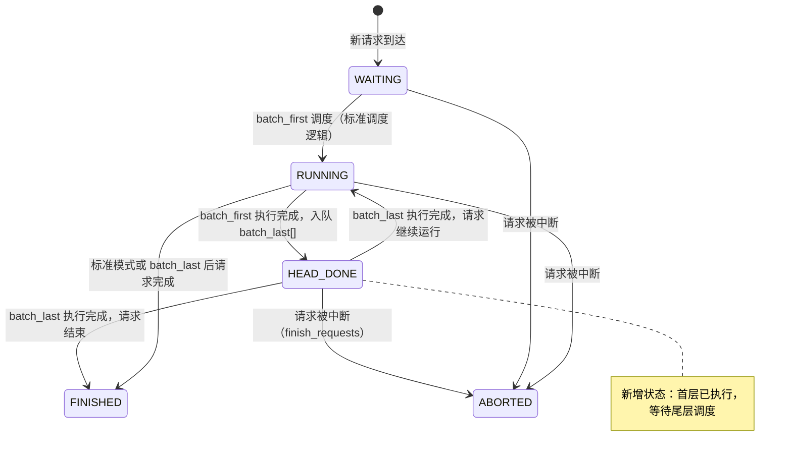
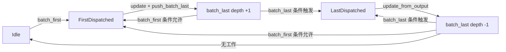

# Phase 1：边云协同推理异步调度 EngineCore 完整框架详细设计文档

> 基于 `PDmix分布式边云推理支持异步调度简要设计文档.md` 与 `vllm-v0.20.2_layerwise` 代码分析

---

## 1. 设计背景与目标

### 1.1 现状问题

当前 PDmix 分布式边云推理中，一个 batch 的首层（Head）与尾层（Tail）执行在**同一个 step 内强耦合**：

1. **边侧 NPU 空转**：边侧 Worker 执行完 batch1 首层后，必须阻塞等待云侧返回 hidden state，再推进尾层；期间即使 Scheduler 已准备好 batch2 的 SchedulerOutput，也无法下发。
2. **云侧气泡大**：云侧执行两个 batch 之间，至少要等待 batch1 尾层执行时间 + batch2 首层执行时间 + 双向 hidden state 传输时间。

### 1.2 Phase 1 目标

完成 **EngineCore 全层级**的异步调度框架，实现首尾解耦的完整逻辑闭环：

- **Scheduler 层**：新增 `batch_last[]` 队列，实现 batch_first / batch_last / EMPTY 三级优先级调度。
- **EngineCore 层**：`step()` 根据 `batch_type` 分别处理首层执行后入队、尾层执行后状态更新。
- **请求状态层**：定义首层执行后请求的中间状态（`HEAD_DONE`），确保 batch_last 执行前状态一致性。
- **数据层**：`SchedulerOutput` 扩展 `batch_type` 与 `FirstStageContext`。

### 1.3 Phase 1 功能点细分

| 编号 | 功能点 | 涉及文件 | 说明 |
|:---|:---|:---|:---|
| F1 | **数据结构定义** | `output.py` | `BatchType` 枚举、`FirstStageContext`、`SchedulerOutput` 扩展 |
| F2 | **SchedulerInterface 扩展** | `interface.py` | `push_batch_last()` / `get_batch_last_depth()` / `has_head_done_requests()` |
| F3 | **首尾调度算法** | `scheduler.py` | `schedule()` 策略层 + `_schedule_standard()` 私有方法 |
| F4 | **batch_first 执行后处理** | `core.py`, `scheduler.py` | EngineCore 识别 `FIRST`，调度器标记 `HEAD_DONE` 并存入 `batch_last[]` |
| F5 | **batch_last 执行后处理** | `core.py`, `scheduler.py` | EngineCore 识别 `LAST`，正常 `update_from_output()`、采样、状态流转 |
| F6 | **请求状态扩展** | `request.py`, `scheduler.py` | 新增 `RequestStatus.HEAD_DONE`，`finish_requests()` 和 `has_requests()` 覆盖 |
| F7 | **配置与 CLI** | `parallel.py`, `arg_utils.py` | `enable_edge_cloud_async_sched`、`max_batch_last_depth` |
| F8 | **异常与边界** | `scheduler.py` | `finish_requests()` 清理 `batch_last[]`，`abort` 时释放 KV Cache |

---

## 2. 术语定义

| 术语 | 定义 |
|:---|:---|
| **batch_first** | 首次调度单元。请求来源为 `waiting[]` 或 `running`，对应执行模型首层（Head / segment_a）。标记 `BatchType.FIRST`。 |
| **batch_last** | 尾次调度单元。请求来源为 `batch_last[]` 队列，对应执行模型尾层（Tail / segment_e）。标记 `BatchType.LAST`。 |
| **batch_last[]** | 边侧 Scheduler 新增的**双端队列**，缓存已执行完首层、等待执行尾层的 SchedulerOutput。 |
| **BatchType** | SchedulerOutput 的扩展标记字段：`FULL` / `FIRST` / `LAST` / `EMPTY`。 |
| **HEAD_DONE** | 新增请求状态。表示请求已完成首层执行，正在 `batch_last[]` 中等待尾层调度。 |
| **max_batch_last_depth** | `batch_last[]` 允许的最大堆积深度，**默认值为 2**。 |
| **FirstStageContext** | 首层执行完成后传递给尾层调度的上下文快照（预留结构）。 |

---

## 3. 总体设计思路

### 3.1 调度策略层

在现有 `Scheduler.schedule()` 入口增加**调度策略层**，每次调度前根据系统状态动态决策：

```
┌─────────────────────────────────────────┐
│  EngineCore.step()                       │
│    └─▶ Scheduler.schedule()             │
│          └─▶ 【新增】首尾调度策略层       │
│                ├─▶ batch_first (优先级1) │
│                ├─▶ batch_last  (优先级2) │
│                └─▶ EMPTY       (优先级3) │
└─────────────────────────────────────────┘
```

**核心原则**：
- 当 `batch_last[]` 堆积未达到上限且存在可调度新请求时，**优先下发 batch_first**，让边侧和云侧尽早开始计算。
- 当 `batch_last[]` 堆积达到上限（≥2）或没有新请求时，**优先下发 batch_last**，避免尾层饥饿。
- 两个条件均不满足时，返回 `EMPTY`，EngineCore 进入空闲等待。

### 3.2 EngineCore 执行分支

`EngineCore.step()` 根据 `SchedulerOutput.batch_type` 分支处理：

| batch_type | 行为 |
|:---|:---|
| `FULL` | 标准模式，执行完整模型，正常采样和状态更新。 |
| `FIRST` | 执行模型（当前 Worker 层仍为完整模型，Phase 2 后截断为 Head），不采样，不检查 stop，执行后调用 `push_batch_last()` 将请求标记为 `HEAD_DONE` 并入队。返回空 outputs。 |
| `LAST` | 从 `batch_last[]` 弹出，执行模型（Phase 2 后截断为 Tail），正常采样，将请求状态从 `HEAD_DONE` 恢复为 `RUNNING` 或 `FINISHED`。返回正常 outputs。 |
| `EMPTY` | 无可调度工作，返回空。 |

---

## 4. 数据结构变更

### 4.1 SchedulerOutput 扩展

**文件**：`vllm/vllm/v1/core/sched/output.py`

```python
import enum

class BatchType(enum.Enum):
    """边云异步调度 batch 类型。"""
    FULL = "full"       # 标准模式：首尾层在同一个 step 内执行
    FIRST = "first"     # 仅执行首层（Head）
    LAST = "last"       # 仅执行尾层（Tail）
    EMPTY = "empty"     # 空 batch


@dataclass
class FirstStageContext:
    """首层执行完成后需要传递给尾层调度的上下文信息。
    
    Phase 1 中基础结构，Phase 2/3 逐步填充 hidden state 元数据、
    KV 块快照、双通道传输描述等。
    """
    # 原始 scheduler_output 的快照（用于尾层重建输入）
    orig_scheduler_output: "SchedulerOutput"
    
    # 该 batch 进入 batch_last[] 的时间戳（用于超时/调度策略/性能分析）
    enqueue_timestamp: float = 0.0


@dataclass
class SchedulerOutput:
    # ... 现有字段保持不变 ...
    
    # ── 新增 ──
    batch_type: BatchType = BatchType.FULL
    
    # 当 batch_type == LAST 时，该字段承载首层执行上下文。
    # Phase 1 中预留接口，Phase 2 填充实现。
    first_stage_context: FirstStageContext | None = None
    
    @classmethod
    def make_empty(cls) -> "SchedulerOutput":
        return cls(
            scheduled_new_reqs=[],
            scheduled_cached_reqs=CachedRequestData.make_empty(),
            num_scheduled_tokens={},
            total_num_scheduled_tokens=0,
            scheduled_spec_decode_tokens={},
            scheduled_encoder_inputs={},
            num_common_prefix_blocks=[],
            finished_req_ids=set(),
            free_encoder_mm_hashes=[],
            batch_type=BatchType.EMPTY,
        )
```

### 4.2 RequestStatus 扩展

**文件**：`vllm/vllm/v1/request.py`

```python
class RequestStatus(enum.Enum):
    """The status of a request."""
    WAITING = "waiting"
    RUNNING = "running"
    PREEMPTED = "preempted"
    FINISHED_STOPPED = "finished_stopped"
    FINISHED_LENGTH_CAPPED = "finished_length_capped"
    FINISHED_ABORTED = "finished_aborted"
    FINISHED_IGNORED = "finished_ignored"
    
    # ── 新增：边云异步调度 ──
    HEAD_DONE = "head_done"  # 首层已执行完成，等待尾层调度
    
    # ... 现有 is_finished 等辅助方法需覆盖 HEAD_DONE ...
```

**辅助方法调整**：

```python
@staticmethod
def is_finished(status: "RequestStatus") -> bool:
    return status in (
        RequestStatus.FINISHED_STOPPED,
        RequestStatus.FINISHED_LENGTH_CAPPED,
        RequestStatus.FINISHED_ABORTED,
        RequestStatus.FINISHED_IGNORED,
    )

@staticmethod
def is_active(status: "RequestStatus") -> bool:
    """请求是否处于活跃状态（可被调度或已在 batch 中）。"""
    return status in (
        RequestStatus.WAITING,
        RequestStatus.RUNNING,
        RequestStatus.PREEMPTED,
        RequestStatus.HEAD_DONE,
    )
```

### 4.3 SchedulerInterface 扩展

**文件**：`vllm/vllm/v1/core/sched/interface.py`

```python
class SchedulerInterface(ABC):
    # ... 现有接口 ...
    
    @abstractmethod
    def push_batch_last(self, scheduler_output: "SchedulerOutput") -> None:
        """将已执行完首层的 SchedulerOutput 推入 batch_last[] 队列。
        
        由 EngineCore 在 batch_first 执行完成后调用。
        """
        raise NotImplementedError
    
    @abstractmethod
    def get_batch_last_depth(self) -> int:
        """返回当前 batch_last[] 队列深度。"""
        raise NotImplementedError
    
    @abstractmethod
    def has_head_done_requests(self) -> bool:
        """返回 batch_last[] 中是否有待执行尾层的请求。"""
        raise NotImplementedError
```

---

## 5. 调度算法详细设计

### 5.1 优先级与条件判定

| 调度类型 | 优先级 | 判定条件 | 说明 |
|:---|:---:|:---|:---|
| **batch_first** | 1 | `len(batch_last) < max_batch_last_depth` **且** (`waiting` 非空 或 `running` 非空) **且** `pause_state == UNPAUSED` | 允许连续下发首层，但限制堆积深度，避免尾层无限饥饿。 |
| **batch_last** | 2 | `len(batch_last) > 0` | 当无法继续堆积首层，或没有新请求时，必须推进尾层。 |
| **EMPTY** | 3 | 以上均不满足 | 无可调度工作，EngineCore 空闲等待。 |

### 5.2 调度算法伪代码

```python
def schedule(self) -> SchedulerOutput:
    # ── Step 0: 边云异步调度未启用，走原有逻辑 ──
    if not self.enable_edge_cloud_async_sched:
        return self._schedule_standard(batch_type=BatchType.FULL)
    
    # ── Step 1: 尝试 batch_first ──
    if (
        len(self.batch_last) < self.max_batch_last_depth
        and (self.waiting or self.running)
        and self._pause_state == PauseState.UNPAUSED
    ):
        scheduler_output = self._schedule_standard()
        # 标准调度可能返回空 batch（无请求可调度）
        if scheduler_output.total_num_scheduled_tokens > 0:
            scheduler_output.batch_type = BatchType.FIRST
            logger.debug(
                "[EdgeCloudSched] Dispatch batch_first, "
                "batch_last_depth=%d/%d",
                len(self.batch_last), self.max_batch_last_depth
            )
            return scheduler_output
        # 否则 fall-through 尝试 batch_last 或 EMPTY
    
    # ── Step 2: 尝试 batch_last ──
    if self.batch_last:
        scheduler_output = self.batch_last.popleft()
        scheduler_output.batch_type = BatchType.LAST
        logger.debug(
            "[EdgeCloudSched] Dispatch batch_last, "
            "remaining_batch_last=%d", len(self.batch_last)
        )
        return scheduler_output
    
    # ── Step 3: 无可调度工作 ──
    logger.debug("[EdgeCloudSched] Dispatch EMPTY")
    return SchedulerOutput.make_empty()
```

### 5.3 `_schedule_standard()` 私有方法

将现有 `schedule()` 的实现完整提取为私有方法 `_schedule_standard()`，**不做任何功能改动**。外层 `schedule()` 仅负责策略决策和 `batch_type` 标记。

```mermaid
flowchart TD
    A[schedule] --> B{enable_edge_cloud_async_sched?}
    B -->|No| C[_schedule_standard + FULL]
    B -->|Yes| D{首尾调度策略层}
    D --> E{batch_first条件?}
    E -->|Yes| F[_schedule_standard + FIRST]
    E -->|No| G{batch_last条件?}
    G -->|Yes| H[从batch_last[]弹出 + LAST]
    G -->|No| I[返回EMPTY]
```

---

## 6. 状态机设计

### 6.1 请求在边侧调度器中的状态流转



### 6.2 调度器内部状态转换



---

## 7. EngineCore 层设计

### 7.1 `step()` 流程调整

**文件**：`vllm/vllm/v1/engine/core.py`

当前 `step()` 流程：
```
schedule() → execute_model() → sample_tokens() → update_from_output()
```

Phase 1 调整后：

```python
def step(self) -> tuple[dict[int, EngineCoreOutputs], bool]:
    if not self.scheduler.has_requests():
        return {}, False
    
    scheduler_output = self.scheduler.schedule()
    
    # ── 空 batch 直接返回 ──
    if scheduler_output.batch_type == BatchType.EMPTY:
        return {}, False
    
    future = self.model_executor.execute_model(scheduler_output, non_block=True)
    grammar_output = self.scheduler.get_grammar_bitmask(scheduler_output)
    
    with (
        self.log_error_detail(scheduler_output),
        self.log_iteration_details(scheduler_output),
    ):
        model_output = future.result()
        if model_output is None:
            model_output = self.model_executor.sample_tokens(grammar_output)
    
    self._process_aborts_queue()
    
    # ── 首尾解耦处理 ──
    if scheduler_output.batch_type == BatchType.FIRST:
        # 首层执行完成：更新 KV Cache / computed tokens，但不采样/不生成输出
        self.scheduler.update_from_output(scheduler_output, model_output)
        # 将 batch 推入 batch_last[]，标记请求为 HEAD_DONE
        self.scheduler.push_batch_last(scheduler_output)
        return {}, True  # model_executed=True，但无输出返回前端
    
    # batch_last 或标准模式：正常处理
    engine_core_outputs = self.scheduler.update_from_output(
        scheduler_output, model_output
    )
    return engine_core_outputs, scheduler_output.total_num_scheduled_tokens > 0
```

### 7.2 `has_work()` 逻辑确认

**文件**：`vllm/vllm/v1/engine/core.py`

`EngineCoreProc.has_work()` 定义为：
```python
def has_work(self) -> bool:
    return (
        self.engines_running
        or self.scheduler.has_requests()
        or bool(self.batch_queue)
    )
```

Phase 1 中 `Scheduler.has_requests()` 已扩展为覆盖 `batch_last[]`：
```python
def has_requests(self) -> bool:
    return (
        self.has_unfinished_requests()
        or self.has_finished_requests()
        or bool(self.batch_last)
    )
```

因此 `has_work()` **无需修改**，`batch_last[]` 中的待处理请求已能被正确识别。

---

## 8. Scheduler 核心实现

### 8.1 `__init__` 新增字段

```python
class Scheduler(SchedulerInterface):
    def __init__(self, ...):
        # ... 现有初始化代码 ...
        
        # ── 新增：边云异步调度相关 ──
        self.batch_last: deque[SchedulerOutput] = deque()
        self.max_batch_last_depth = (
            vllm_config.parallel_config.max_batch_last_depth
            if hasattr(vllm_config.parallel_config, "max_batch_last_depth")
            else 2
        )
        self.enable_edge_cloud_async_sched = (
            vllm_config.parallel_config.enable_edge_cloud
            and getattr(vllm_config.parallel_config, "enable_edge_cloud_async_sched", False)
        )
```

### 8.2 `push_batch_last()` 实现

```python
def push_batch_last(self, scheduler_output: SchedulerOutput) -> None:
    """将已执行完首层的 SchedulerOutput 推入 batch_last[] 队列。
    
    由 EngineCore 在 batch_first 执行完成后调用。
    """
    scheduler_output.first_stage_context = FirstStageContext(
        orig_scheduler_output=scheduler_output,
        enqueue_timestamp=time.monotonic(),
    )
    self.batch_last.append(scheduler_output)
    
    # 标记该 batch 中所有请求为 HEAD_DONE 状态
    for req_id in scheduler_output.num_scheduled_tokens:
        req = self.requests.get(req_id)
        if req and req.status == RequestStatus.RUNNING:
            req.status = RequestStatus.HEAD_DONE
    
    logger.debug(
        "[EdgeCloudSched] batch_first -> batch_last, depth=%d/%d",
        len(self.batch_last), self.max_batch_last_depth
    )
```

### 8.3 `update_from_output()` 针对 batch_first / batch_last 的处理

在 `update_from_output()` 主循环中，根据 `scheduler_output.batch_type` 分支：

```python
def update_from_output(
    self,
    scheduler_output: SchedulerOutput,
    model_runner_output: ModelRunnerOutput,
) -> dict[int, EngineCoreOutputs]:
    # ... 现有前置逻辑 ...
    
    for req_id, num_tokens_scheduled in num_scheduled_tokens.items():
        assert num_tokens_scheduled > 0
        request = self.requests.get(req_id)
        if request is None or request.is_finished():
            continue
        
        # ── batch_first：不采样，不生成输出，仅更新 KV Cache ──
        if scheduler_output.batch_type == BatchType.FIRST:
            # 首层执行：更新 num_computed_tokens（已推进的 token 数）
            # 但不采样、不检查 stop、不生成 EngineCoreOutput
            # KV Cache 已在模型执行过程中更新
            continue
        
        # ── batch_last / FULL：正常处理 ──
        req_index = model_runner_output.req_id_to_index[req_id]
        generated_token_ids = (
            sampled_token_ids[req_index] if sampled_token_ids else []
        )
        
        # batch_last：请求从 HEAD_DONE 恢复为 RUNNING
        if scheduler_output.batch_type == BatchType.LAST:
            if request.status == RequestStatus.HEAD_DONE:
                request.status = RequestStatus.RUNNING
        
        # ... 后续正常采样、stop 检查、输出生成逻辑 ...
```

### 8.4 `finish_requests()` 清理 batch_last[]

```python
def finish_requests(
    self, request_ids: str | Iterable[str] | None, finished_status: RequestStatus
) -> list[tuple[str, int]]:
    # ... 现有逻辑 ...
    
    # ── 新增：清理 batch_last[] 中的被 abort 请求 ──
    if self.enable_edge_cloud_async_sched and self.batch_last:
        aborted_in_batch_last: list[SchedulerOutput] = []
        for so in self.batch_last:
            so_req_ids = set(so.num_scheduled_tokens.keys())
            if so_req_ids & set(request_ids):
                aborted_in_batch_last.append(so)
        for so in aborted_in_batch_last:
            self.batch_last.remove(so)
            # 释放该 SO 中所有请求的 KV Cache
            for req_id in so.num_scheduled_tokens:
                if req_id in self.requests:
                    self.kv_cache_manager.free(self.requests[req_id])
                    del self.requests[req_id]
    
    # ... 现有返回逻辑 ...
```

### 8.5 `has_requests()` 与 `has_unfinished_requests()` 覆盖

```python
def has_requests(self) -> bool:
    return (
        self.has_unfinished_requests()
        or self.has_finished_requests()
        or bool(self.batch_last)
    )

def get_num_unfinished_requests(self) -> int:
    if self._pause_state == PauseState.PAUSED_ALL:
        return 0
    if self._pause_state == PauseState.PAUSED_NEW:
        return len(self.running) + len(self.batch_last)  # 包含 HEAD_DONE
    num_waiting = (
        len(self.waiting)
        + len(self.skipped_waiting)
        - self.num_waiting_for_streaming_input
    )
    return num_waiting + len(self.running) + len(self.batch_last)
```

---

## 9. 配置项设计

### 9.1 `ParallelConfig` 扩展

**文件**：`vllm/vllm/config/parallel.py`

```python
@dataclass
class ParallelConfig:
    # ... 现有字段 ...
    
    enable_edge_cloud: bool = False
    edge_npu_count: int = 0
    cloud_npu_count: int = 0
    is_edge_node: bool = False
    
    # ── 新增：Phase 1 配置 ──
    enable_edge_cloud_async_sched: bool = False
    """启用边云异步首尾调度（Phase 1+）。开关控制，默认关闭。"""
    
    max_batch_last_depth: int = 2
    """batch_last[] 队列最大堆积深度。默认 2，限制尾层饥饿。"""
    
    def __post_init__(self):
        # ... 现有校验 ...
        if self.enable_edge_cloud_async_sched and not self.enable_edge_cloud:
            raise ValueError(
                "enable_edge_cloud_async_sched requires enable_edge_cloud=True"
            )
        if self.enable_edge_cloud_async_sched and self.max_batch_last_depth < 1:
            raise ValueError(
                "max_batch_last_depth must be >= 1 when enable_edge_cloud_async_sched=True"
            )
```

### 9.2 CLI 参数扩展

**文件**：`vllm/vllm/engine/arg_utils.py`

在 `--cloud-npu-count` 后新增：

```python
parallel_group.add_argument(
    "--enable-edge-cloud-async-sched",
    **parallel_kwargs["enable_edge_cloud_async_sched"]
)
parallel_group.add_argument(
    "--max-batch-last-depth",
    **parallel_kwargs["max_batch_last_depth"]
)
```

---

## 10. 边界情况与异常处理

### 10.1 batch_last[] 堆积满

**场景**：`batch_last[]` 深度达到 `max_batch_last_depth`（默认 2），且仍有新请求到达。

**处理**：
- `batch_first` 条件不满足（`len(batch_last) < 2` 为 False）。
- 调度器转为尝试 `batch_last`，强制推进尾层执行，释放堆积。
- 若 `batch_last[]` 与 `waiting[]` / `running[]` 同时非空，优先保证尾层不饥饿。

### 10.2 batch_last[] 中的请求被 Abort

**场景**：客户端断开连接，请求在 `batch_last[]` 队列中被标记为 abort。

**处理**：
- `finish_requests()` 遍历 `batch_last[]`，移除被 abort 的请求对应的 `SchedulerOutput`。
- 释放其占用的 KV Cache 块（`kv_cache_manager.free()`）。
- 若请求在首层执行期间被 abort（尚未入队 `batch_last[]`），由现有 abort 机制处理。

### 10.3 空 batch_last[] 且无新请求

**场景**：系统处于低负载，所有请求均已完成尾层执行，且无新请求到达。

**处理**：
- `schedule()` 返回 `EMPTY`。
- `EngineCore` 通过 `has_requests()` 判断为 False，进入空闲等待状态。

### 10.4 与现有 batch_queue 的共存

**场景**：当前代码中 `EngineCore` 已支持 `batch_queue`（用于 PP 异步调度，大小 = `pp_size`）。

**处理**：
- `batch_queue` 用于**单节点内**多个 batch 的流水线并行缓冲。
- `batch_last[]` 用于**边云之间**首层与尾层的解耦调度。
- 两者作用域不同，互不冲突。`batch_last[]` 中的 batch 在尾层调度时，仍可进入 `batch_queue` 进行本地 PP 调度。

### 10.5 batch_first 执行后 model_output 仍为完整模型

**场景**：Phase 1 中 Worker 层尚未修改（Phase 2 才截断为 Head/Tail），因此 `batch_first` 实际执行的是完整模型。

**处理**：
- Phase 1 的核心价值是**搭建完整逻辑框架**。
- `update_from_output()` 在 `BatchType.FIRST` 分支下跳过采样和 stop 检查，执行后 `push_batch_last()` 入队。
- 虽然 Worker 执行了完整模型，但 EngineCore 层面已正确分离了首层/尾层的处理逻辑。Phase 2 Worker 修改后，系统直接可用。
- **降级策略**：若需要，可在 Phase 1 中临时让 `BatchType.FIRST` 也走正常采样路径（作为兼容模式），但这会违背异步调度初衷。建议 Phase 1 严格按设计实现。

---

## 11. 测试验证方案

### 11.1 单元测试

| 测试用例 | 输入 | 预期行为 |
|:---|:---|:---|
| **TC-01** 标准模式关闭 | `enable_edge_cloud_async_sched=False` | `schedule()` 完全走原有逻辑，`batch_type` 始终为 `FULL`，行为与修改前一致。 |
| **TC-02** 连续两个 batch_first | 2 个新请求，`batch_last` 为空，开关开启 | 请求1 `FIRST`；`push_batch_last` 后请求2 `FIRST`；`batch_last` 深度 = 2。 |
| **TC-03** batch_last 满后转尾 | `batch_last` 深度 = 2，第3个请求到达，开关开启 | 第3个请求无法 `FIRST`，转而调度 `batch_last` 中的尾层（`LAST`）。 |
| **TC-04** 仅有 batch_last | `batch_last` 有1个，`waiting`/`running` 空，开关开启 | 调度 `LAST`，正常执行尾层，请求状态 `HEAD_DONE` → `RUNNING`。 |
| **TC-05** 完全空闲 | 所有队列为空，开关开启 | 返回 `EMPTY`，`has_requests()` = False。 |
| **TC-06** Abort 清理 | 请求在 `batch_last` 中被 abort，开关开启 | `batch_last` 中被移除，KV Cache 释放，请求状态变为 `FINISHED_ABORTED`。 |
| **TC-07** batch_first 不采样 | `BatchType.FIRST` 执行完成 | `update_from_output()` 不生成 EngineCoreOutput，不检查 stop，请求状态变为 `HEAD_DONE`。 |
| **TC-08** batch_last 状态恢复 | `BatchType.LAST` 执行完成 | 请求状态 `HEAD_DONE` → `RUNNING`，正常采样和输出生成。 |

### 11.2 集成测试

| 测试用例 | 场景 | 验证点 |
|:---|:---|:---|
| **IT-01** 单请求端到端 | 1 个 prompt 请求，开关开启 | 调度顺序：`FIRST` → `push_batch_last` → `LAST`，结果正确，请求状态流转完整。 |
| **IT-02** 双请求流水线 | 2 个 prompt 请求连续到达，开关开启 | 调度顺序：`FIRST(req1)` → `FIRST(req2)` → `LAST(req1)` → `LAST(req2)`，无死锁。 |
| **IT-03** 混合 P/D | Prefill + Decode 请求混合，开关开启 | `batch_first` / `batch_last` 对 P/D 均适用，状态正确。 |
| **IT-04** 开关关闭兼容性 | 开关关闭，多请求场景 | 行为与修改前完全一致，所有请求 `BatchType.FULL`。 |

### 11.3 性能基准

- **指标 1**：`batch_last[]` 平均堆积深度（目标 ≤ 1.5）。
- **指标 2**：边侧 NPU 空转率（Phase 1 框架搭建后，在 Phase 2 Worker 配合后可显著下降）。
- **指标 3**：调度延迟（`schedule()` 增加的策略层耗时，目标 < 1ms）。

---

## 12. Phase 边界与后续阶段衔接

### 12.1 Phase 1 交付范围

- ✅ `batch_last[]` 队列数据结构与管理。
- ✅ 首尾调度算法（三级优先级策略、条件判定）。
- ✅ `SchedulerOutput.batch_type` 标记与 `FirstStageContext` 预留结构。
- ✅ `RequestStatus.HEAD_DONE` 及状态流转。
- ✅ EngineCore `step()` 分支处理（`FIRST` 入队 / `LAST` 正常处理）。
- ✅ `update_from_output()` 针对 `FIRST` / `LAST` 的分支逻辑。
- ✅ 配置项与 CLI 参数。
- ✅ 异常处理（abort 清理、队列满、空队列）。

### 12.2 Phase 2 衔接点

- **Worker 层截断**：`model_runner_v1.py` 中 `segment_a` / `segment_e` / `segment_c` 根据 `batch_type` 执行对应段。
- **Worker 回调机制**：首层执行完成后，Worker 向 EngineCore 发送完成事件（或 EngineCore 通过 future 结果判断）。
- **`FirstStageContext` 填充**：保存首层执行后的 hidden state meta、KV 块快照。

### 12.3 Phase 3 衔接点

- **双通道 hidden state 传输**：当前单通道 PP Comm 拓展为双通道，支持 `batch1` 尾层回传与 `batch2` 首层下发并行。
- **`FirstStageContext.intermediate_tensors_meta`** 与双通道传输元数据对接。

---

## 13. 风险与缓解

| 风险 | 影响 | 缓解措施 |
|:---|:---|:---|
| `batch_last[]` 堆积导致 KV Cache 占用增加 | OOM | 限制 `max_batch_last_depth` 默认值为 2；支持动态调整。 |
| 首尾解耦后请求状态一致性复杂 | 调度 bug、结果错误 | `FirstStageContext` 保存完整调度快照；单测覆盖所有状态转换。 |
| 与现有 PP batch_queue 交互异常 | 死锁或性能退化 | `batch_last[]` 与 `batch_queue` 独立；集成测试验证。 |
| Worker 层 Phase 1 未配合，实际效果不可见 | 验证困难 | Phase 1 严格搭建逻辑框架；单元测试 mock Worker 行为；Phase 2 后立即验证端到端。 |
| `SchedulerOutput` 序列化兼容性 | ZMQ / MQ 通信失败 | 使用 `enum.Enum`（msgspec 原生支持）；集成测试验证跨进程序列化。 |

---

*文档版本：v2.0*  
*基于代码分支：vllm-v0.20.2_layerwise*  
*编写日期：2026-06-03*
