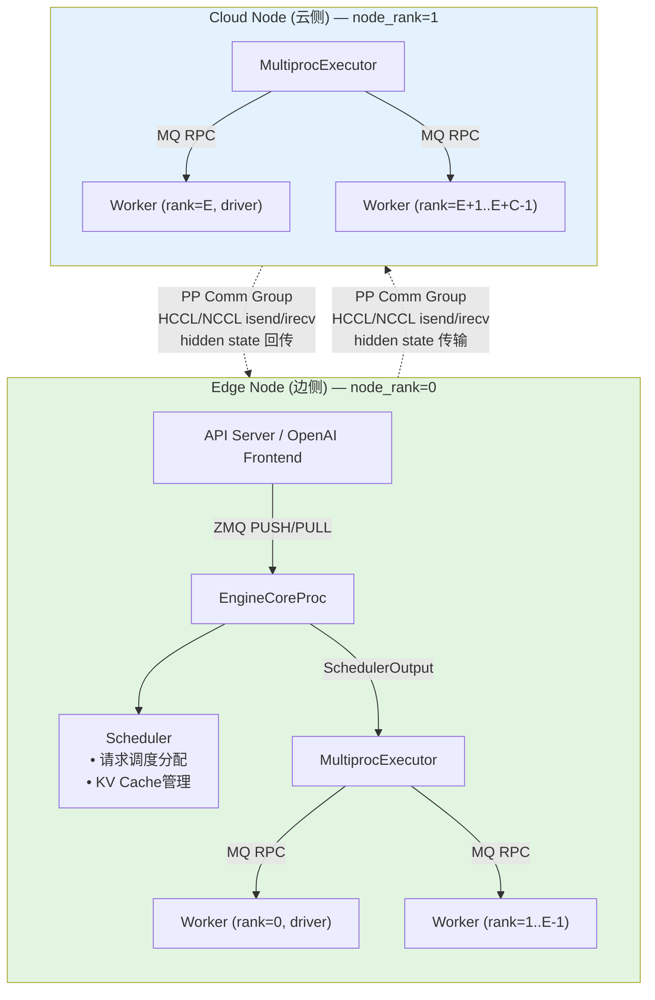
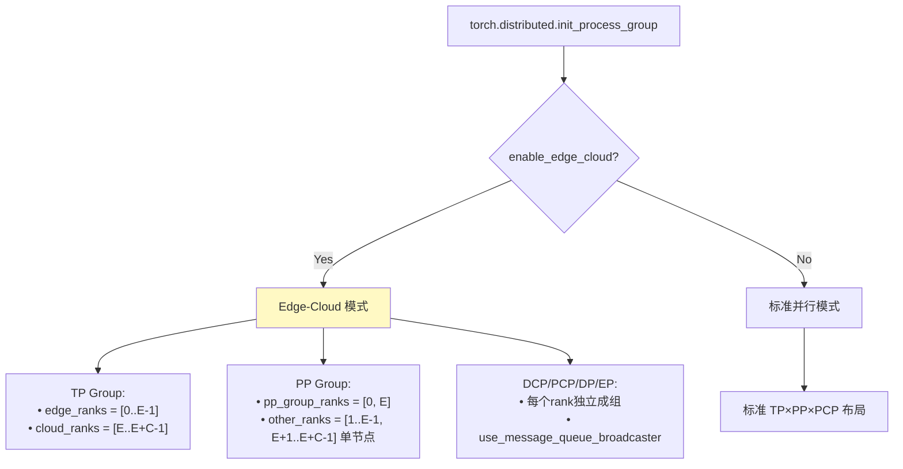
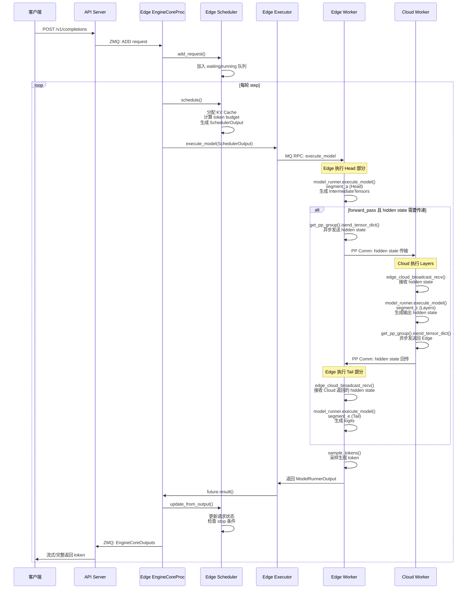
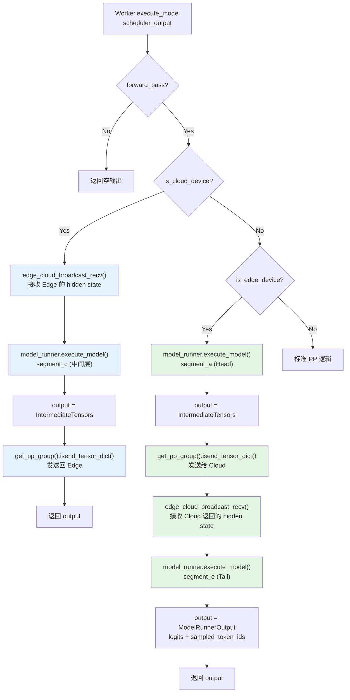
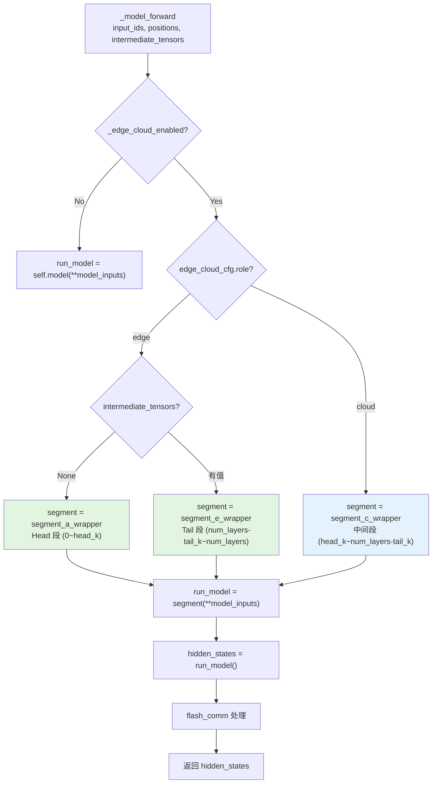

# 边云协同推理请求处理框架流程图

> 基于 `D:\Kisella\vllm-v0.20.2_layerwise\` 目录下的 vllm 与 vllm-ascend 代码分析

---

## 一、系统架构概览



---

## 二、模型加载与角色划分

```mermaid
flowchart LR
    subgraph Edge_Load["Edge 模型加载"]
        E1["_load_model_edge_cloud()<br/>role='edge'"]
        E2["LayerShardLoader.apply_sharding()<br/>head_k + tail_k 层"]
        E3["segment_a: 0 ~ head_k<br/>(Embedding + Head Transformer)"]
        E4["segment_e: num_layers-tail_k ~ num_layers<br/>(Tail Transformer + LM Head)"]
        E1 --> E2 --> E3 & E4
    end

    subgraph Cloud_Load["Cloud 模型加载"]
        C1["_load_model_edge_cloud()<br/>role='cloud'"]
        C2["LayerShardLoader.apply_sharding()<br/>中间层"]
        C3["segment_c: head_k ~ num_layers-tail_k<br/>(Layers 中间层)"]
        C1 --> C2 --> C3
    end

    Edge_Load -.->|PP group: [0, E]<br/>TP edge: [0..E-1]| Cloud_Load

    style Edge_Load fill:#e1f5e1
    style Cloud_Load fill:#e3f2fd
```

---

## 三、通信组初始化（parallel_state.py）



---

## 四、单次 Step 请求处理完整流程



---

## 五、Worker 层执行细节（vllm-ascend worker.py）



---

## 六、Model Runner 前向传播（model_runner_v1.py）



---

## 七、Edge-Cloud 数据传输（edge_cloud_broadcast_recv）

```mermaid
flowchart TD
    A[edge_cloud_broadcast_recv] --> B{pp_group.world_size == 2?}
    B -->|Yes| C["pp_group.irecv_tensor_dict()<br/>从对端接收 tensor_dict"]
    C --> D["_split_tensor_dict 获取 metadata"]
    D --> E["tp_group.broadcast_object(metadata, src=0)"]
    E --> F["broadcast_postprocess:<br/>对 tensor_list 逐个 broadcast<br/>tp_group.ranks[0] -> 其他 ranks"]
    F --> G[返回 tensor_dict + comm_handles + postprocess]

    B -->|No| H["tp_group.broadcast_object(None, src=0)<br/>获取 metadata_list"]
    H --> I["根据 metadata 创建空 tensor"]
    I --> J["broadcast_postprocess:<br/>逐个 tensor broadcast"]
    J --> K[返回 recv_tensor_dict + [] + [postprocess]]

    style C fill:#fff9c4
    style E fill:#fff9c4
```

---

## 八、关键代码路径索引

| 模块 | 文件路径 | 关键类/函数 |
|:---|:---|:---|
| **概念定义** | `PDmix分布式边云协同推理.md` | 边云协同推理概念与执行流程 |
| **参数配置** | `vllm/vllm/config/parallel.py` | `ParallelConfig.enable_edge_cloud`, `edge_npu_count`, `cloud_npu_count`, `is_edge_node` |
| **CLI参数** | `vllm/vllm/engine/arg_utils.py` | `--enable-edge-cloud`, `--edge-npu-count`, `--cloud-npu-count` |
| **通信组初始化** | `vllm/vllm/distributed/parallel_state.py` | `initialize_model_parallel()` — Edge-Cloud 模式 TP/PP/DCP/PCP/DP/EP 组创建 |
| **EngineCore主循环** | `vllm/vllm/v1/engine/core.py` | `EngineCore.step()` — schedule → execute → update |
| **调度器** | `vllm/vllm/v1/core/sched/scheduler.py` | `Scheduler.schedule()` — 请求调度与 batch 生成 |
| **Executor** | `vllm/vllm/v1/executor/multiproc_executor.py` | `MultiprocExecutor._init_executor()` — 边云模式下 worker 创建与 MQ 管理 |
| **GPU Model Runner** | `vllm/vllm/v1/worker/gpu_model_runner.py` | `execute_model()`, `is_edge_cloud_first_stage()` |
| **Ascend Model Runner** | `vllm-ascend/vllm_ascend/worker/model_runner_v1.py` | `_load_model_edge_cloud()`, `_model_forward()`, `segment_a/e/c` |
| **Ascend Worker** | `vllm-ascend/vllm_ascend/worker/worker.py` | `execute_model()` — 边云通信与分段执行 |
| **Ascend分布式** | `vllm-ascend/vllm_ascend/distributed/parallel_state.py` | `edge_cloud_broadcast_recv()` — PP tensor 接收与 TP 广播 |

---

## 九、执行阶段对比

### Prefill 阶段

```
Edge (Head)          Cloud (Layers)          Edge (Tail)
  |                        |                       |
  |-- segment_a ---------> |                       |
  |   (Embedding+Head)     |                       |
  |                        |-- segment_c --------> |
  |   isend_tensor_dict    |   (中间层计算)         |   edge_cloud_broadcast_recv
  |                        |                       |
  |<-- irecv_tensor_dict --|                       |
  |                        |   isend_tensor_dict   |
  |-- segment_e ---------------------------------> |
  |                        |                       |   (Tail+LM Head)
  |                        |                       |-- compute_logits
  |                        |                       |-- sample_tokens
```

### Decode 阶段

```
流程与 Prefill 相同，但输入为单 token：
Edge Head (1 token) → Cloud Layers → Edge Tail → 采样 1 token
```

---

*流程图生成时间：2026-06-03*
*基于代码版本：vllm-v0.20.2_layerwise*
